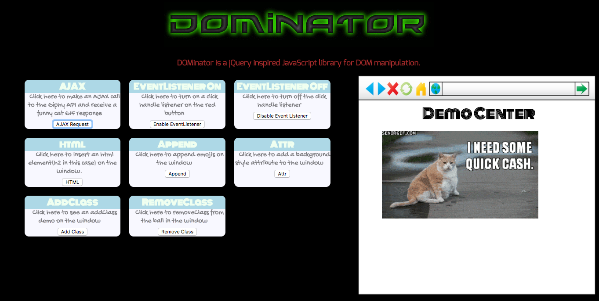

# DOMinator
### [Live DOMinator](http://www.farshidzaman.tech/DOMinator/)


DOMinator is a jQuery inspired javascript library for DOM manipulation. Using DOMinator, users can:
  * Select single or multiple DOM elements
  * Traverse and manipulate DOM elements
  * Build DOM element
  * Create `DOMNodeCollection` objects from `HTMLElement`s
  * Queue functions until DOM is fully loaded
  * Make AJAX requests

## Getting Started

Anyone with basic javascript understanding can use this library by downloading this repo into their project and including the webpack output `dominator.js` in the source code. To update or make changes in the library, user can run the command "webpack --watch" from their terminal and that will continuously watch for changes in the source code.

```html
<head>
  <meta charset="utf-8">
  <link rel="stylesheet" href="./css/reset.css">
  <script type="text/javascript" src="../lib/dominator.js"></script>
  ...
</head>
```

## API

[`$d`](#l)  

[DOM Traversal](#dom-traversal)  
  * [`children`](#children)  
  * [`parent`](#parent)  

[DOM Manipulation](#dom-manipulation)  
  * [`html`](#html)  
  * [`empty`](#empty)  
  * [`append`](#append)  
  * [`remove`](#remove)  
  * [`attr`](#attr)  
  * [`addClass`](#addclass)  
  * [`removeClass`](#removeclass)  
  * [`toggleClass`](#toggleclass)  

[Event Listeners](#event-listeners)  
  * [`on`](#on)  
  * [`off`](#off)  

[`$d.ajax`](#lajax)  

### $d

The DOMinator library utilizes the global variable of `$d` as a wrapper for all of the methods in the DOMinator library.  

`$d` is most commonly used to select elements with CSS selectors.  `$d("div")` returns a `DOMNodeCollection` object which is an object custom to the DOMinator library that is an array of `HTMLElement`s.  

`$d` can also be used to create `DOMNodeCollection` objects from unwrapped `HTMLElement`s giving these elements access to DOMinator methods.  

The third use of `$d` takes in a string of HTML code, builds `HTMLElement`(s) from the code, and then wraps the `HTMLElement`(s) in a `DOMNodeCollection` object.

The final use of `$l` is as tool to queue functions to run once the DOM is fully loaded.


### DOM Traversal


#### `children`

Returns a `DOMNodeCollection` object containing all of the children elements of every `HTMLElement` in the original `DOMNodeCollection`.  Note that this only includes the direct children.

#### `parent`

Returns a `DOMNodeCollection` object containing the parent elements of every `HTMLElement` in the original `DOMNodeCollection`.  

### DOM Manipulation

`DOMNodeCollection` methods to view and/or change DOM elements

#### `html`

Returns the `innerHTML` for the first element in the `DOMNodeCollection` if no argument is given.  If a string argument is given, changes the `innerHTML` of each `DOMNodeCollection` element to the string argument.

#### `empty`

Empties the innerHTML of each `DOMNodeCollection` element

#### `append`

Takes a single `HTMLElement`, `DOMNodeCollection`, or `string` argument and appends it to each `DOMNodeCollection` element.

```javascript
  append(arg){
    if (this.HTMLElements.length === 0) {
      return;
    }

    if(typeof arg === 'object' && !(arg instanceof DOMNodeCollection)){
      arg = $d(arg);
    }

    if(typeof arg === 'string') {
      this.HTMLElements.forEach(htmlElement => {
        htmlElement.innerHTML += arg;
      });
    }

    if ( arg instanceof DOMNodeCollection ) {
      this.HTMLElements.forEach(htmlElement => {
        arg.HTMLElements.forEach( child => {
          htmlElement.appendChild(child);
        });
      });
    }
    return this;
  }
```

#### `remove`

Remove each `DOMNodeCollection` element from the DOM.

#### `attr`

Takes either one (`attr(attribute)`) or two (`attr(attribute, value)`) arguments.  If given one argument, the method gets the value of the attribute given for the the first element in the `DOMNodeCollection`.  The method sets the attribute, given as the first argument, as the value, given as the second argument, for each `DOMNodeCollection` element.

#### `addClass`

Adds a class, given as an argument, to each `DOMNodeCollection` element.

#### `removeClass`

Removes a class, given as an argument, from each `DOMNodeCollection` element.

#### `toggleClass`

Toggles a class, given as an argument, for each `DOMNodeCollection` element.

### Event Listeners


#### `on`

Adds event listener to each `DOMNodeCollection` element.  List of events are available [here](https://developer.mozilla.org/en-US/docs/Web/Events).

#### `off`

Removes event listener from each `DOMNodeCollection` element.

### $d.ajax

Sends HTTP Requests.  Accepts a `Hash` object as an argument with any of the following attributes:
  * method (default: "GET"): HTTP Request method or type
  * url (default: window.location.href): URL for HTTP Request
  * success: success callback
  * error: error callback
  * contentType (default: 'application/x-www-form-urlencoded; charset=UTF-8'): content type of HTTP Request

```javascript
$d.ajax = (options) => {
  const defaults = {
    method: 'GET',
    url: "",
    success: () => {},
    error: console.log,
    data: {},
    contentType: 'application/x-www-form-urlencoded; charset=UTF-8'
  };

  options = $d.extend(defaults, options);
  const xhr = new XMLHttpRequest();
  xhr.open(options.method, options.url);
  xhr.onload = () => {
    if (xhr.status === 200) {
      options.success(xhr.response);
    }
    else {
      options.error(xhr.response);
    }
  };

  xhr.send(JSON.stringify(options.data));
};
```
